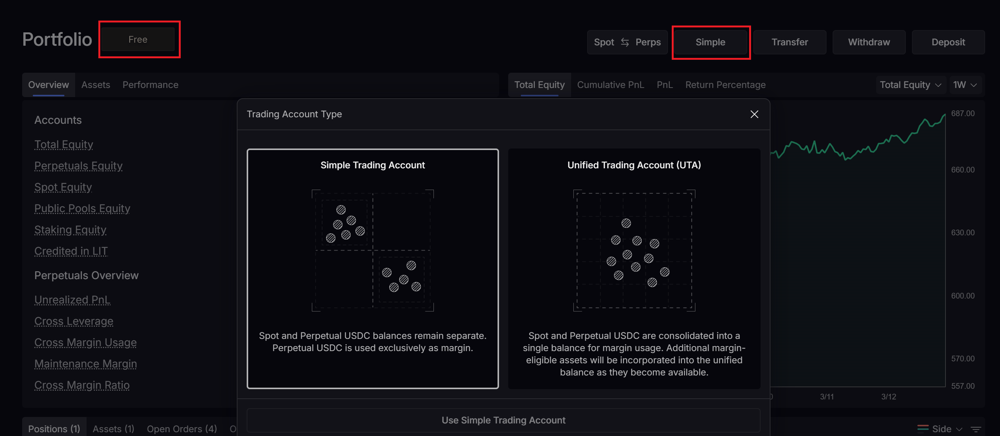

# Passivbot - Lighter Exchange Fork

> **Video tutorial:** Watch the associated walkthrough on YouTube: https://youtu.be/E87Pbgfosoo

A fork of [Passivbot](https://github.com/enarjord/passivbot) adapted to run on [Lighter](https://lighter.xyz) — a ZK-rollup perpetuals DEX with **zero trading fees for both maker and taker orders**.

Passivbot is a high-frequency market-making bot that places and cancels large numbers of limit orders. On a traditional exchange, fees would eat deeply into returns. Lighter's zero-fee model for both maker and taker orders makes it an ideal venue for this strategy: every trade that would otherwise cost fees is pure profit instead.

> **Affiliate link to support this project:** [Trade on Lighter](https://app.lighter.xyz/?referral=FREQTRADE) — spot & perpetuals, fully decentralized, no KYC, zero fees for both maker and taker orders.

:warning: **Used at one's own risk** :warning:

> :penguin: **Linux only** — the `lighter` Python SDK requires Linux for transaction signing. Windows users must run this inside [WSL](https://learn.microsoft.com/en-us/windows/wsl/install) or Docker.
>
> macOS has not been tested natively, but Docker on macOS will work.
>
> A Linux VPS is also a good option and is even recommended. This bot does not need a fast or expensive VPS, since latency is not a major concern for Passivbot in general.

> :warning: **Lighter account type requirement:** Use a **Simple Trading Account**. Do **not** use a **Unified Trading Account (UTA)**.
> 
> :warning: Recommended to use a **sub-account**.
>
> **Recommended Lighter tier:** The **Free** tier works well with Passivbot. It keeps trading at **0 fees for both maker and taker orders**, and in practice its latency has not been a problem for this bot.

<p align="center">
  
</p>

v7.8.4

## Fork Overview

> :warning: This is a **heavily modified fork** of [enarjord/passivbot](https://github.com/enarjord/passivbot) (v7.8.4). It has been substantially reworked to run exclusively on [Lighter](https://lighter.xyz). It is **not a drop-in replacement** for upstream passivbot and is not compatible with the exchanges supported there (Binance, Bybit, Hyperliquid, etc.). If you want multi-exchange support, use the [upstream project](https://github.com/enarjord/passivbot).

Key changes from upstream:

- **Lighter exchange adapter** — full order management, position tracking, WebSocket streaming, and auth token handling via the `lighter-sdk`.
- **Candle fetching** — direct HTTP to Lighter's `/api/v1/candles` endpoint with forward-pagination and caching (workaround for a `lighter-sdk` model bug).
- **Docker support** — `Dockerfile_live` and `docker-compose.yml` configured to run as `passivbot-lighter-live`, isolated from any other passivbot containers.
- **Rate limit mitigations** — 1-hour auth tokens, WS re-auth every 55 min, volume-quota-aware free-slot pacing.
- **Linux-only runtime** — due to the `lighter` SDK's native signing dependency.

## Overview

Passivbot is a cryptocurrency trading bot written in Python and Rust, intended to require minimal user intervention.

It operates on perpetual futures derivatives markets, automatically creating and cancelling limit buy and sell orders on behalf of the user. It does not try to predict future price movements, it does not use technical indicators, nor does it follow trends. Rather, it is a contrarian market maker, providing resistance to price changes in both directions, thereby "serving the market" as a price stabilizer.

Passivbot's behavior may be backtested on historical price data, using the included backtester whose CPU heavy functions are written in Rust for speed. Also included is an optimizer, which finds better configurations by iterating thousands of backtests with different candidates, converging on the optimal ones with an evolutionary algorithm.

## Strategy

Inspired by the Martingale betting strategy, the robot will make a small initial entry and double down on its losing positions multiple times to bring the average entry price closer to current price action. The orders are placed in a grid, ready to absorb sudden price movements. After each re-entry, the robot quickly updates its closing orders at a set take-profit markup. This way, if there is even a minor market reversal, or "bounce", the position can be closed in profit, and it starts over.

### Trailing Orders
In addition to grid-based entries and closes, Passivbot may be configured to utilize trailing entries and trailing closes.

For trailing entries, the bot waits for the price to move beyond a specified threshold and then retrace by a defined percentage before placing a re-entry order. Similarly, for trailing closes, the bot waits before placing its closing orders until after the price has moved favorably by a threshold percentage and then retraced by a specified percentage. This may result in the bot locking in profits more effectively by exiting positions when the market shows signs of reversing instead of at a fixed distance from average entry price.

Grid and trailing orders may be combined, such that the robot enters or closes a whole or a part of the position as grid orders and/or as trailing orders.

### Forager
The Forager feature dynamically chooses the most volatile markets on which to open positions. Volatility is defined as the EMA of the log range for the most recent 1m candles, i.e. `EMA(ln(high / low))`.

### Unstucking Mechanism
Passivbot manages underperforming, or "stuck", positions by realizing small losses over time. If multiple positions are stuck, the bot prioritizes positions with the smallest gap between the entry price and current market price for "unstucking". Losses are limited by ensuring that the account balance does not fall under a set percentage below the past peak balance.

## Quickstart

### Prerequisites
- Linux (the `lighter` SDK requires Linux for signing; Windows users can use WSL)
- Python 3.12
- Rust >= 1.90 (only needed when running without Docker; Docker builds Rust automatically)
- Docker & Docker Compose (for containerized deployment)
- A [Lighter](https://lighter.xyz) account with a private key

### 1. Clone & Install

```bash
git clone <this-repo> passivbot_lighter
cd passivbot_lighter
pip install -r requirements-live.txt
```

### 2. Configure API Keys

Copy the example and fill in your Lighter credentials:

```bash
cp api-keys.json.example api-keys.json
```

Edit `api-keys.json` — find the `lighter_01` entry and set:
- `private_key` — your Lighter wallet private key
- `account_index` — your Lighter account index (visible in the Lighter UI)
- `api_key_index` — your API key index (from Lighter key management). **Use a value above 10** to avoid conflicts with indices reserved by the Lighter system.

#### Finding your account index

To find the `account_index` for your main account or sub-accounts, query the Lighter REST API with your L1 (wallet) address:

```
GET https://mainnet.zklighter.elliot.ai/api/v1/account?by=l1_address&value=<YOUR_L1_ADDRESS>
```

The response contains an `accounts` array listing every account tied to that address. Here is what to look for:

```json
{
  "accounts": [
    {
      "account_type": 0,
      "account_index": 107607,
      "collateral": "0.002856",
      ...
    },
    {
      "account_type": 1,
      "account_index": 281474976687926,
      "collateral": "719.860000",
      ...
    }
  ]
}
```

- **`account_type`** — `0` = main account, `1` = sub-account (Simple Trading Account).
- **`account_index`** — the value to put in `api-keys.json`. Pick the sub-account (`account_type: 1`) that holds your trading funds (check `collateral` > 0).

### 3. Run with Docker (recommended)

```bash
docker compose up -d                        # start passivbot-lighter-live
docker logs -f passivbot-lighter-live       # follow logs
docker compose down                         # stop
```

### 4. Run directly (without Docker)

```bash
python src/main.py configs/hype_top.json
```

### Logging

Passivbot uses Python's logging module throughout the bot, backtester, and supporting tools.
- Use `--log-level` on `src/main.py` or `src/backtest.py` to adjust verbosity at runtime. Accepts `warning`, `info`, `debug`, `trace` or numeric `0-3` (`0 = warnings only`, `1 = info`, `2 = debug`, `3 = trace`). You can also use `-v` / `--verbose` as a shorthand for `--log-level debug`.
- Persist a default by adding a top-level section to your config: `"logging": {"level": 2}`. The CLI flag always overrides the config value for that run.
- CandlestickManager and other subsystems inherit the chosen level so EMA warm-up, data fetching, and cache behaviour can be inspected consistently.

### Running Multiple Bots

Running several Passivbot instances against the same exchange on one machine is supported. Each process shares the same on-disk OHLCV cache, and the candlestick manager now uses short-lived, self-healing locks with automatic stale cleanup so that one stalled process cannot block the rest. No manual deletion of lock files is required; the bot removes stale locks on startup and logs whenever a lock acquisition times out.

## Requirements

- Python 3.12
- Rust >= 1.90 (for building the backtesting extension; handled automatically when using Docker)
- [requirements-live.txt](requirements-live.txt) dependencies

## Pre-optimized configurations

Coming soon...

See also https://pbconfigdb.scud.dedyn.io/

## Documentation:

For more detailed information about Passivbot, see documentation files here: [docs/](docs/)

## Third Party Links and Tip Jar

**Passivbot GUI**
A graphical user interface for Passivbot:
https://github.com/msei99/pbgui

**BuyMeACoffee:**
https://www.buymeacoffee.com/enarjord

**Donations:**
If the robot is profitable, consider donating as showing gratitude for its development:

- USDT or USDC Binance Smart Chain BEP20:
0x4b7b5bf6bea228052b775c052843fde1c63ec530
- USDT or USDC Arbitrum One:
0x4b7b5bf6bea228052b775c052843fde1c63ec530

Bitcoin (BTC) via Strike:
enarjord@strike.me

## License
This is free and unencumbered software released into the public domain.

Anyone is free to copy, modify, publish, use, compile, sell, or
distribute this software, either in source code form or as a compiled
binary, for any purpose, commercial or non-commercial, and by any
means.

In jurisdictions that recognize copyright laws, the author or authors
of this software dedicate any and all copyright interest in the
software to the public domain. We make this dedication for the benefit
of the public at large and to the detriment of our heirs and
successors. We intend this dedication to be an overt act of
relinquishment in perpetuity of all present and future rights to this
software under copyright law.

THE SOFTWARE IS PROVIDED "AS IS", WITHOUT WARRANTY OF ANY KIND,
EXPRESS OR IMPLIED, INCLUDING BUT NOT LIMITED TO THE WARRANTIES OF
MERCHANTABILITY, FITNESS FOR A PARTICULAR PURPOSE AND NONINFRINGEMENT.
IN NO EVENT SHALL THE AUTHORS BE LIABLE FOR ANY CLAIM, DAMAGES OR
OTHER LIABILITY, WHETHER IN AN ACTION OF CONTRACT, TORT OR OTHERWISE,
ARISING FROM, OUT OF OR IN CONNECTION WITH THE SOFTWARE OR THE USE OR
OTHER DEALINGS IN THE SOFTWARE.

For more information, please refer to <https://unlicense.org/>
